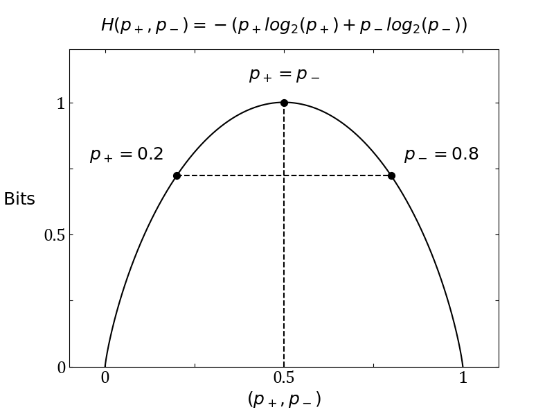
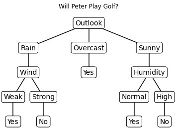
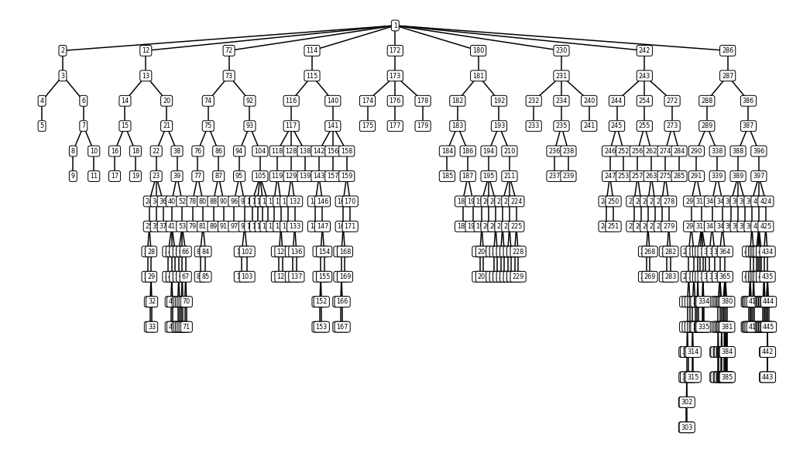

<h1>Decision Tree Learning Classification</h1>
<p align="justify">
    This is a naive C4.5 algorithm used for classification of data written in Python.
</p>

<h1>Mathematical Model</h1>

<p align="left">
    
</p>

<p align="center">
    
</p>

<p align="center">
    
</p>

<p align="center">
    
</p>

<p align="center">
    
</p>

<p align="center">
    
</p>

<p align="center">
    
</p>

<p align="center">
    
</p>

<p align="center">
    
</p>

<p align="center">
    
</p>

<p align="center">
    
</p>

<p align="center">
    
</p>

<p align="center">
    
</p>

<p align="center">
    
</p>

```python
from decision_tree import DecisionTree
```


```python
model = DecisionTree()
model.importcsv( 'tennis.csv' )
model.data
```


    {('Overcast', 'High', 'Strong', 'Yes'),
     ('Overcast', 'High', 'Weak', 'Yes'),
     ('Overcast', 'Normal', 'Strong', 'Yes'),
     ('Overcast', 'Normal', 'Weak', 'Yes'),
     ('Rain', 'High', 'Strong', 'No'),
     ('Rain', 'High', 'Weak', 'Yes'),
     ('Rain', 'Normal', 'Strong', 'No'),
     ('Rain', 'Normal', 'Weak', 'Yes'),
     ('Sunny', 'High', 'Strong', 'No'),
     ('Sunny', 'High', 'Weak', 'No'),
     ('Sunny', 'Normal', 'Strong', 'Yes'),
     ('Sunny', 'Normal', 'Weak', 'Yes')}


```python
model.label
```


    ['Outlook', 'Humidity', 'Wind', 'Play']


```python
model.learn( model.data )
model.plot( 'Will Peter Play Golf?' )
```




```python
model = DecisionTree()
model.importcsv( 'mushrooms.csv' )
len( model.data )
```


    8124


```python
model.label
```


    ['cap shape',
     'cap surface',
     'cap color',
     'bruises',
     'odor',
     'gill attachment',
     'gill spacing',
     'gill size',
     'gill color',
     'stalk shape',
     'stalk root',
     'stalk surface above ring',
     'stalk surface below ring',
     'stalk color above ring',
     'stalk color below ring',
     'veil type',
     'veil color',
     'ring number',
     'ring type',
     'spore print color',
     'population',
     'habitat',
     'class']


```python
model.testAndTrain( ratio = 0.25 )
```

    Samples in training set:  2031
    Samples tested         :  6093
    Total samples          :  8124
    Model accuracy         :  99.61 %

```python
model.plot()
```

<p align="center">
    
</p>
